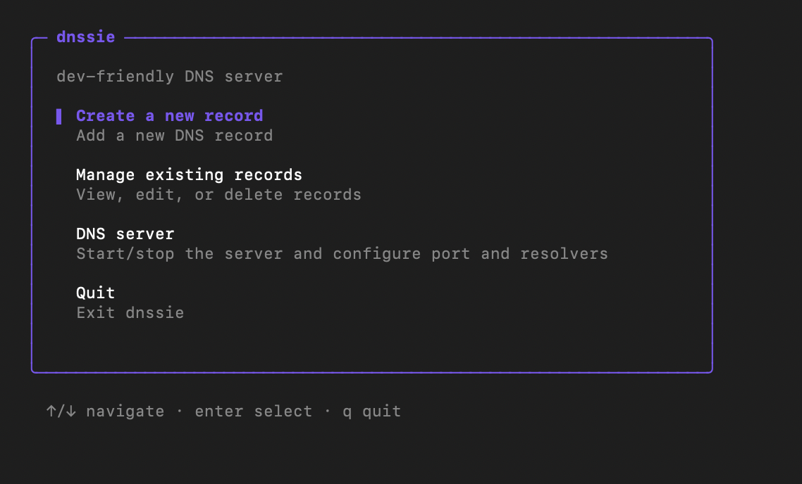
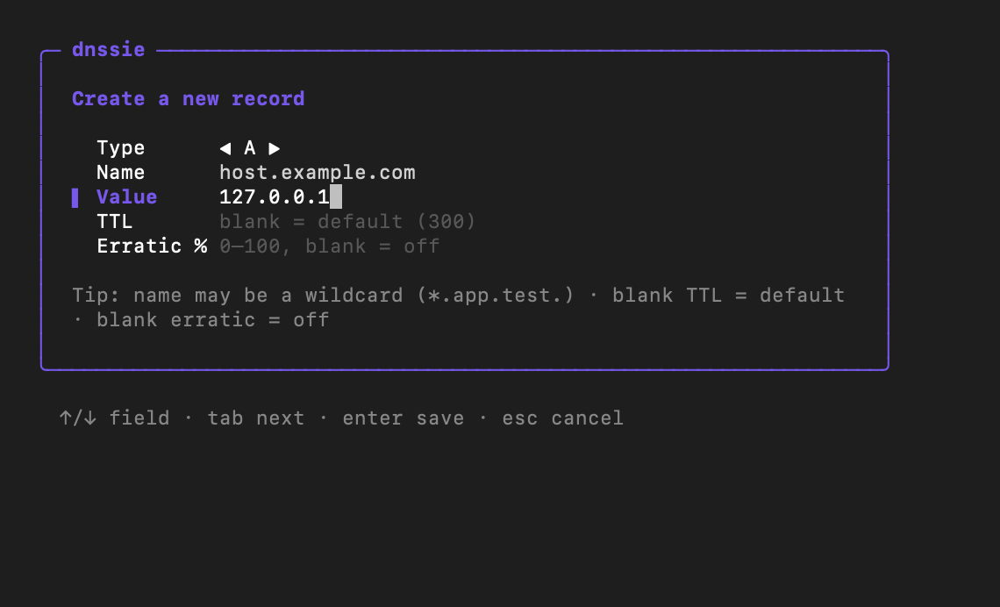
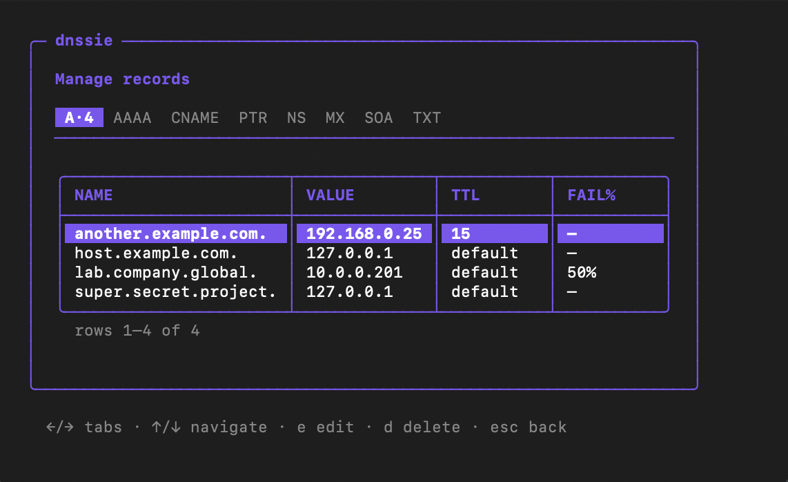
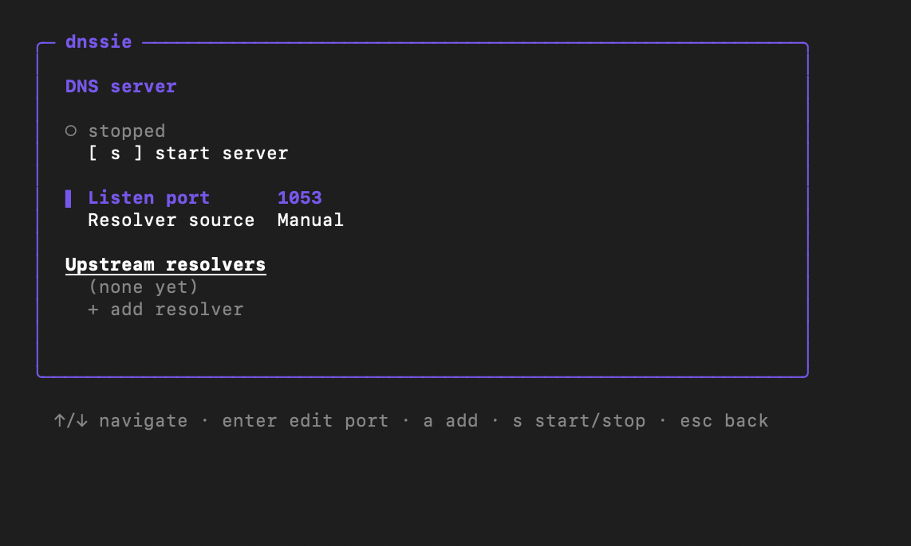

# dnssie

A developer-focused DNS server with a terminal UI for straightforward management.

<table>
  <tr>
    <td><a href="docs/screenshots/main.png"></a></td>
    <td><a href="docs/screenshots/create.png"></a></td>
  </tr>
  <tr>
    <td><a href="docs/screenshots/manage.png"></a></td>
    <td><a href="docs/screenshots/server.png"></a></td>
  </tr>
</table>

## Why not just edit /etc/hosts (or C:\Windows\System32\drivers\etc\hosts)?

`dnssie` is built to do what a simple hosts file can't:

* Serve any record from the most common types (`CNAME`, `MX`, `TXT`, `SOA`, `NS`, `PTR`).
* Wildcard support for `A` and `AAAA` record types.
* Rootless: no administrator privileges required by default (unless you want to run the DNS server on port 53, of course).
* Define per-record TTL values.
* "Erratic mode": test client caching and failure handling with definable failure percentages on record lookups.
* TOML-based configuration and storage, safe and suitable for collaboration in git (or your favourite VCS).

## What this is not

It's not your new production DNS server. Don't expose `dnssie` to the public internet or configure all of your clients to use it.

For actual production needs, stick with the usual suspects: [dnsmasq](https://thekelleys.org.uk/dnsmasq/doc.html) or [Unbound](https://nlnetlabs.nl/projects/unbound/about/).

## Quick Start

Prebuilt binaries for Linux, macOS, and Windows are on the
[Releases page](https://github.com/rmmorrison/dnssie/releases).

1. Download the archive for your platform and extract it.
2. Move the `dnssie` binary somewhere on your `PATH`.
3. Run `dnssie`.

```sh
# Example: macOS on Apple silicon
tar -xzf dnssie_0.1.0_darwin_arm64.tar.gz
sudo mv dnssie /usr/local/bin/
dnssie
```

(Windows archives are `.zip`; run `dnssie.exe`.)

In the UI, choose **Create a new record** to add e.g. `app.test.` → `127.0.0.1`,
then open **DNS server** and press `s` to start it. Query it from another
terminal:

```sh
dig @127.0.0.1 -p 1053 app.test
```

The server keeps running after you quit the UI — it listens on `127.0.0.1:1053`
by default. Relaunch `dnssie` to see its status and recent lookups, or to stop
it.

## Build from source

Requires Go 1.26+:

```sh
go install github.com/rmmorrison/dnssie/cmd/dnssie@latest
```

Or from a clone:

```sh
git clone https://github.com/rmmorrison/dnssie
cd dnssie
go build -o dnssie ./cmd/dnssie
```

## License

MIT — see [LICENSE](LICENSE).
